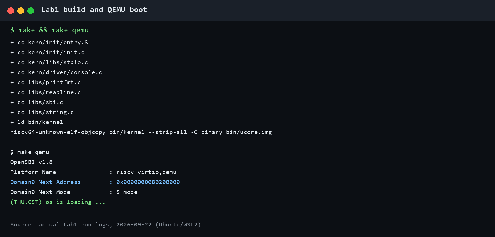
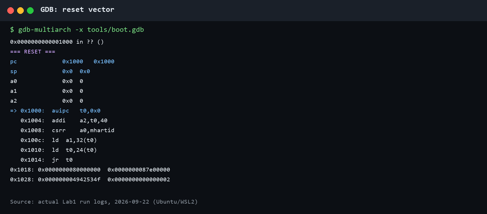
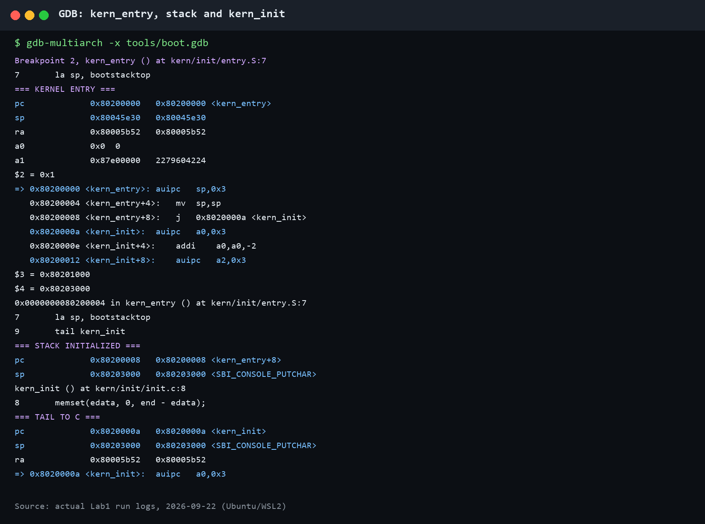

# 操作系统实验报告

## 实验基本信息

| 项目 | 内容 |
|------|------|
| **实验名称** | Lab 1：RISC-V 内核启动与 GDB 调试 |
| **小组成员** | 2411061-牛雨萱、2410721-何熹淳、2414166-滕鑫 |
| **完成日期** | 2026-09-23 |

### 小组分工

练习分工如下：

| 成员 | 负责的练习/模块 |
|------|----------------|
| 2410721-何熹淳 | 练习1：阅读 `entry.S`，分析 `la sp, bootstacktop` 与 `tail kern_init` |
| 2414166-滕鑫 | 练习2：搭建 QEMU + GDB 调试环境，跟踪从复位地址到内核入口的启动流程 |
| 2411061-牛雨萱 | 环境适配、测试验证、实验报告整合与仓库整理 |

实验报告分工：何熹淳整理练习1的原理分析，滕鑫整理练习2的调试过程，牛雨萱统一整理实验基本信息、整体逻辑、测试截图、知识点总结和交付目录。

---

## 一、实验目的

本实验的主要目的是：

1. 理解 RISC-V 计算机从复位代码、OpenSBI 固件到操作系统内核的启动流程。
2. 理解链接脚本、内核入口、启动栈和 C 语言入口之间的关系。
3. 掌握使用交叉编译器构建 RISC-V 内核，并使用 QEMU 运行内核的方法。
4. 掌握通过 GDB 远程连接 QEMU，观察 PC、SP、RA、参数寄存器和特权级的方法。
5. 学习使用 AI 辅助阅读底层代码、分析调试结果，同时用实际编译和运行结果核对 AI 给出的结论。

---

## 二、实验环境

### 2.1 软件环境

| 项目 | 版本或说明 |
|------|------------|
| 宿主环境 | Windows + WSL2 |
| Linux | Ubuntu 26.04 LTS |
| 交叉编译器 | `riscv64-unknown-elf-gcc 14.2.0` |
| 构建工具 | GNU Make 4.4.1 |
| 模拟器 | QEMU 10.2.1，RISC-V virt 平台 |
| 固件 | OpenSBI v1.8 |
| 调试器 | `gdb-multiarch` |

### 2.2 AI 工具

| 成员 | AI 编程工具 | 底层模型 | 备注 |
|------|------------|---------|------|
| 2411061-牛雨萱 | Codex 桌面应用 | GPT-5 | 用于报告整合、目录检查和测试材料整理 |
| 2410721-何熹淳 | Codex 桌面应用 | GPT-5 | 用于阅读 `entry.S`、解释伪指令并核对反汇编结果 |
| 2414166-滕鑫 | Codex 桌面应用 | GPT-5 | 用于整理 GDB 调试步骤和寄存器观察结果 |

本实验将 AI 用作代码阅读和调试辅助工具。所有地址、寄存器值和启动输出都通过本机编译、QEMU 运行及 GDB 调试进行核对，没有直接将模型回答当作实验结果。

---

## 三、实验整体逻辑分析

### 3.1 本章节的逻辑主线

本章围绕“一个最小 RISC-V 内核如何开始运行”展开。源代码首先被交叉编译为 RISC-V 目标文件，链接脚本再把各段安排到以 `0x80200000` 为起点的内存区域。QEMU 模拟 RISC-V virt 机器并从复位地址开始执行，复位代码将控制权交给 OpenSBI。OpenSBI 完成固件初始化和特权级切换，最终跳转到内核入口 `kern_entry`。内核入口建立自己的栈，随后进入 C 函数 `kern_init`，清零 BSS 区并通过 SBI 输出启动信息。

完整链路为：

```text
C/汇编源代码
    → RISC-V 目标文件
    → ELF 内核与裸镜像
    → QEMU 复位代码（0x1000）
    → OpenSBI（0x80000000）
    → kern_entry（0x80200000）
    → 建立内核栈
    → kern_init
    → SBI 控制台输出
```

### 3.2 功能的逐步实现

1. 首先准备交叉编译和模拟环境，因为普通 x86 编译器和处理器不能直接生成、执行本实验的 RISC-V 内核。
2. 接着通过 Makefile 编译、链接并生成镜像。链接脚本必须先确定入口地址和各段布局，固件才能把执行权交到正确位置。
3. 然后在 `kern_entry` 中建立启动栈。C 函数调用依赖有效的栈，必须先完成这一准备才能安全进入 `kern_init`。
4. 随后在 `kern_init` 中清零未初始化数据区，并通过控制台输出验证内核已经运行。
5. 最后使用 GDB 从 `0x1000` 开始观察复位代码、OpenSBI 和内核入口，以寄存器与指令证据验证上述启动链。

---

## 四、实验内容与实现

### 功能模块：内核构建与启动适配

**负责人：** 2411061-牛雨萱

#### 模块功能描述

**涉及的构建目标和入口：**

```make
kernel
bin/ucore.img
qemu
debug
gdb
```

**功能说明：**

Makefile 调用 RISC-V 交叉编译器和链接器生成 `bin/kernel`，再由 `objcopy` 生成裸二进制镜像 `bin/ucore.img`。`tools/kernel.ld` 使用 `ENTRY(kern_entry)` 指定入口，将内核基址设为 `0x80200000`，并组织 `.text`、`.rodata`、`.data` 和 `.bss`。

原始 Makefile 使用 generic loader 把镜像写入 `0x80200000`。在当前 QEMU 10.2.1 和默认 OpenSBI v1.8 组合中，固件日志显示下一阶段地址为 0，无法进入内核。将运行和调试目标改用 `-kernel bin/ucore.img` 后，OpenSBI 显示 `Domain0 Next Address = 0x80200000`，内核成功输出启动信息。调试器使用系统已有的 `gdb-multiarch`，GDB 服务仅监听 `127.0.0.1:1234`。

#### 最终提示词

```markdown
请检查提供的 Lab1 Makefile 与当前 QEMU/OpenSBI 的兼容性。先编译并运行，
根据启动日志判断 OpenSBI 是否获得了 0x80200000 作为下一阶段入口。
如果原启动参数无法进入内核，请做最小化的 Makefile 适配，并验证 make、
make qemu 和 QEMU+GDB 调试链路。不要修改 kern/ 和 libs/ 下的课程源代码。
```

#### 实现迭代过程

##### 第一次迭代

**遇到的问题：**

- 代码可以编译，但原始 `make qemu` 只显示 OpenSBI，内核没有输出。
- OpenSBI 日志中的 `Domain0 Next Address` 为 `0x0`，说明没有得到正确的内核入口。

**问题解决策略：**

- 对照链接脚本确认内核入口为 `0x80200000`。
- 使用 QEMU virt 平台支持的 `-kernel` 方式传入镜像，使默认 OpenSBI 获得正确的下一阶段地址。
- 把 GDB 命令改为使用可覆盖的 `GDB` 变量，默认选择当前环境已有的 `gdb-multiarch`。

**最终结果：**

- ✅ 编译、链接及镜像生成成功。
- ✅ OpenSBI 将下一阶段地址识别为 `0x80200000`。
- ✅ 内核输出 `(THU.CST) os is loading ...`。
- ✅ GDB 能连接 QEMU 并到达 `kern_entry` 和 `kern_init`。

---

### 练习1：理解内核启动中的程序入口操作

**负责人：** 2410721-何熹淳

`kern/init/entry.S` 的核心代码如下：

```asm
.globl kern_entry
kern_entry:
    la sp, bootstacktop
    tail kern_init
```

#### 1. `la sp, bootstacktop`

`la` 是“加载地址”的汇编伪指令。这条语句将符号 `bootstacktop` 对应的地址装入栈指针寄存器 `sp`，并不是读取该地址处存放的数据。RISC-V 的栈通常向低地址增长，所以启动时从预留栈空间的高地址端开始使用。

`entry.S` 通过 `.space KSTACKSIZE` 预留启动栈。代码中 `KSTACKPAGE = 2`、`PGSIZE = 4096`，因此启动栈大小为 8192 字节。GDB 观察得到：

```text
bootstack    = 0x80201000
bootstacktop = 0x80203000
```

两者相差 `0x2000`，即 8192 字节。执行 `la` 展开的两条机器指令后，`sp` 从 OpenSBI 留下的值变为 `0x80203000`。这样做的目的是让后续 C 代码使用内核自己管理的栈，以保存返回地址、寄存器和局部数据。

在本次构建中，该伪指令被展开为：

```asm
0x80200000: auipc sp,0x3
0x80200004: mv    sp,sp
```

第二条实际是立即数为零的加法所显示的别名。伪指令如何展开可能随地址和工具链变化，但最终效果都是把 `bootstacktop` 的地址写入 `sp`。

#### 2. `tail kern_init`

`tail` 是尾调用伪指令，将控制权直接转移到 `kern_init`，不为返回到 `kern_entry` 建立新的返回地址。本次链接结果将其优化为：

```asm
0x80200008: j 0x8020000a <kern_init>
```

执行后 PC 进入 `kern_init`，而 RA 保持为固件留下的值，没有像普通 `call` 那样被更新。这符合启动入口的设计：`kern_init` 被声明为 `noreturn`，其末尾进入无限循环，内核不会再返回到 `kern_entry`。

#### 最终提示词

```markdown
请阅读 Lab1 的 kern/init/entry.S，结合 RISC-V 调用约定和内核启动流程，
解释 la sp, bootstacktop 与 tail kern_init 分别完成什么操作、目的是什么。
请区分伪指令与实际机器指令，并结合 objdump 或 GDB 结果验证 SP 和 RA 的变化。
```

---

### 练习2：使用 GDB 验证启动流程

**负责人：** 2414166-滕鑫

#### 1. 调试方法

先运行 `make debug`，让 QEMU 通过 `-S` 在 CPU 执行前暂停，并在本机 1234 端口等待 GDB。另一个终端运行 `make gdb` 连接 QEMU。主要命令为：

```gdb
info registers pc sp a0 a1 a2
x/6i 0x1000
x/4gx 0x1018
hbreak *0x80000000
continue
info registers pc a0 a1 a2
p/x $priv
hbreak *0x80200000
continue
info registers pc sp ra a0 a1
p/x $priv
x/6i $pc
p/x &bootstack
p/x &bootstacktop
si
si
info registers pc sp
si
info registers pc sp ra
```

#### 2. RISC-V 加电后最初执行的地址与功能

本次 QEMU virt 平台的初始 PC 为 `0x1000`，初始 SP 为 0。`0x1000` 是 QEMU 提供的复位跳板代码，不是 OpenSBI 主体。观察到的前六条指令如下：

| 地址 | 指令 | 主要功能 |
|------|------|----------|
| `0x1000` | `auipc t0,0x0` | 获取复位区域的 PC 相对基址 |
| `0x1004` | `addi a2,t0,40` | 将固件动态信息结构地址 `0x1028` 传入 a2 |
| `0x1008` | `csrr a0,mhartid` | 读取当前 hart 编号，本次为 0 |
| `0x100c` | `ld a1,32(t0)` | 读取设备树地址，本次为 `0x87e00000` |
| `0x1010` | `ld t0,24(t0)` | 读取 OpenSBI 入口 `0x80000000` |
| `0x1014` | `jr t0` | 跳转到 OpenSBI |

这些指令的主要作用是准备 hart 编号、设备树和动态固件信息等启动参数，然后跳转到 `0x80000000` 处的 OpenSBI。硬件初始化和特权级切换主要由随后执行的固件完成。

#### 3. OpenSBI 到内核入口

在 `0x80000000` 处断下时：

```text
pc = 0x80000000
a0 = 0
a1 = 0x87e00000
a2 = 0x1028
$priv = 3（M 模式）
```

继续运行并在 `0x80200000` 处断下时：

```text
pc = 0x80200000 <kern_entry>
sp = 0x80045e30
$priv = 1（S 模式）
```

这说明 OpenSBI 在 M 模式完成初始化，然后切换到 S 模式并把控制权交给内核。随后单步执行 `la sp, bootstacktop`，SP 变为 `0x80203000`；再执行尾调用，PC 进入 `0x8020000a <kern_init>`。

本次连接 GDB 时，`0x80200000` 已经包含内核入口指令，说明镜像由 QEMU 在 CPU 运行前装入内存。写监视点不能捕捉已经完成的装载，因而使用执行断点 `hbreak *0x80200000` 验证控制权交接更合适。该结论只针对本次 QEMU 启动方式。

#### 最终提示词

```markdown
请使用 QEMU 和 GDB 跟踪提供的 RISC-V Lab1，从 PC=0x1000 开始，
依次在 0x80000000 和 0x80200000 设置硬件执行断点。记录复位代码、
OpenSBI 入口和 kern_entry 的关键寄存器、特权级及反汇编结果；继续单步
验证 la sp, bootstacktop 和 tail kern_init。结论必须来自实际调试日志。
```

---

## 五、测试与验证

### 5.1 编译及内核运行

`make` 成功编译全部汇编和 C 文件，链接生成 `bin/kernel`，并生成 `bin/ucore.img`。运行 `make qemu` 后，OpenSBI 将下一阶段地址设为 `0x80200000`，内核输出 `(THU.CST) os is loading ...`。



### 5.2 复位地址与 OpenSBI 入口

GDB 连接后 PC 位于 `0x1000`，反汇编显示复位跳板准备启动参数并跳转到 `0x80000000`。



### 5.3 内核入口、栈初始化与 C 入口

GDB 在 `0x80200000 <kern_entry>` 处断下，单步执行后 SP 变为 `0x80203000`，随后 PC 进入 `kern_init`。



### 5.4 评分脚本说明

课程提供的 Lab1 压缩包中没有 Makefile 所引用的 `tools/grade.sh`，因此本实验无法取得 `make grade` 的自动评分结果。本报告没有把自建验证脚本冒充课程评分器，而是通过编译结果、QEMU 启动输出和 GDB 跟踪共同验证 Lab1 的目标。`code/tools/verify_lab1.py` 可重复执行上述构建和调试检查。

---

## 六、实验总结与收获

### 6.1 对操作系统的理解

| 实验知识点 | 对应 OS 原理 | 联系与差异 |
|------------|-------------|------------|
| 复位、固件与内核入口 | 操作系统引导 | 都描述控制权如何逐级交接；本实验由 QEMU 预装镜像，没有真实磁盘引导过程 |
| M 模式与 S 模式 | 特权级与保护机制 | 固件在更高特权级提供 SBI 服务，内核在 S 模式运行；本实验还没有 U 模式用户程序 |
| 启动栈 | 函数调用与执行上下文 | C 函数依赖有效栈；本实验只有启动栈，还没有进程内核栈和上下文切换 |
| 链接脚本与 BSS 清零 | 程序装载和内存布局 | 链接地址决定运行位置；本实验还没有页表、地址空间隔离和动态内存管理 |
| `ecall` 与 SBI | 陷入与系统服务接口 | 内核通过 SBI 请求固件服务；这不同于用户程序向内核发起的系统调用 |
| QEMU + GDB | 目标系统调试 | 在宿主机上观察目标架构状态；模拟环境便于重现，但不等同于真实开发板全部行为 |

本实验尚未涉及但在 OS 原理中非常重要的内容包括：进程和线程、调度与上下文切换、虚拟内存和页表、缺页处理、内存分配、用户程序装载、系统调用、文件系统、中断处理、并发同步与死锁。这些内容需要建立在本实验完成的内核启动基础上。

### 6.2 AI 协作开发的经验

AI 能较快整理启动链、解释汇编伪指令并给出调试方案，但底层实验不能只凭自然语言答案判断正确性。本次原始代码虽然编译成功，内核最初却没有运行；只有检查 OpenSBI 的下一阶段地址、设置 GDB 断点并观察串口输出，才能确定问题和修复是否真实有效。

本次还体会到提示词需要包含代码位置、运行环境、期望观察点和验证标准。要求 AI 区分伪指令与机器指令、区分内存装载与执行跳转，并要求结论引用实际日志，可以明显减少含糊或想当然的回答。所有使用过的提示词汇总在同目录的 `prompt.md`。

---

## 参考资料

1. 课程 Lab1 文档：<http://8.135.34.58/lab2026/_book/lab1/lab1.html>
2. 课程练习说明：<http://8.135.34.58/lab2026/_book/lab1/lab1_2_1_exercise.html>
3. 课程 GDB 调试说明：<http://8.135.34.58/lab2026/_book/lab1/lab1_4_gdb.html>
4. QEMU RISC-V virt 平台文档：<https://www.qemu.org/docs/master/system/riscv/virt.html>
5. 实验源代码及本次实际构建、QEMU、GDB 输出。
